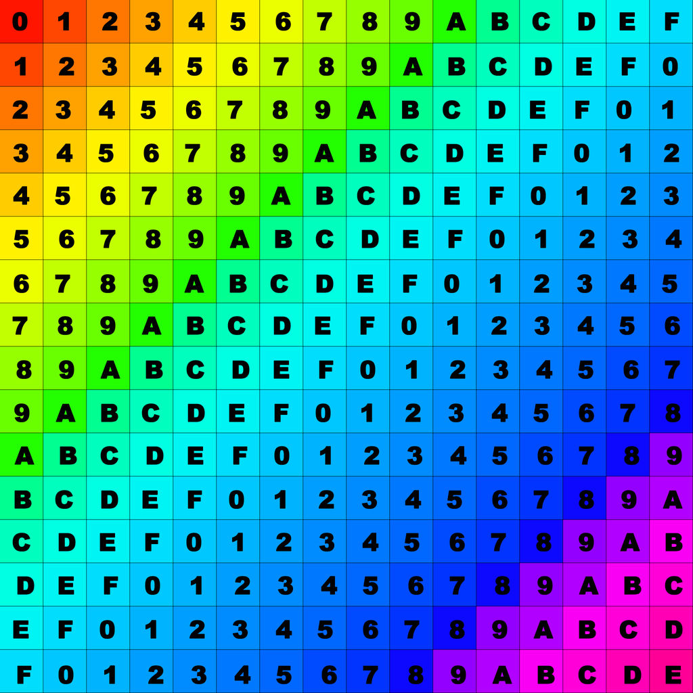
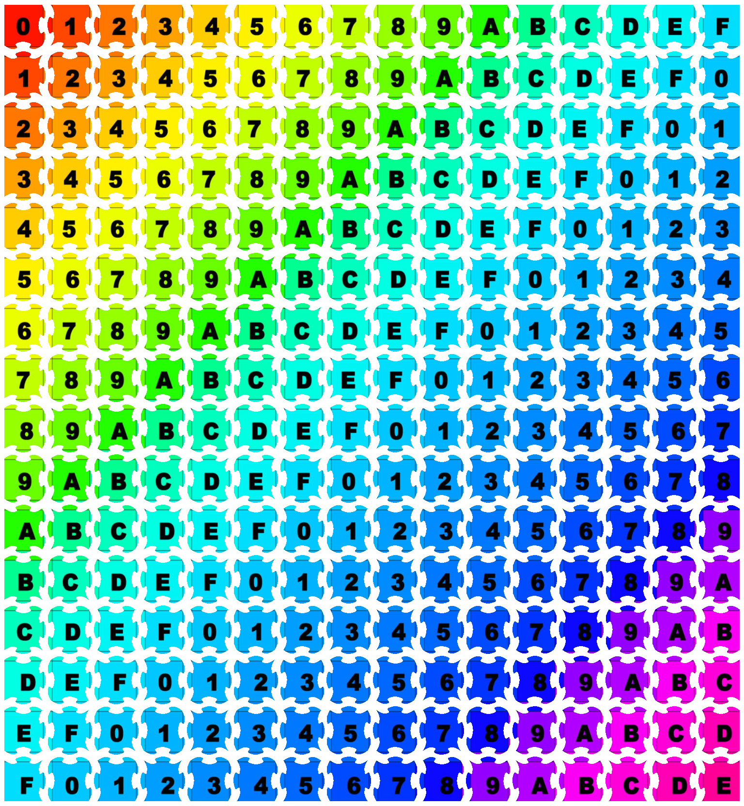

# puzzle-image-gen 🧩

Generates jigsaw puzzle pieces from an input image.

<div align="center">

<div>⬇️</div>

</div>

## Getting started

```bash
cargo run --release -- -i test-images/chungus.jpg -x 32 -y 32 -o output.png
```
